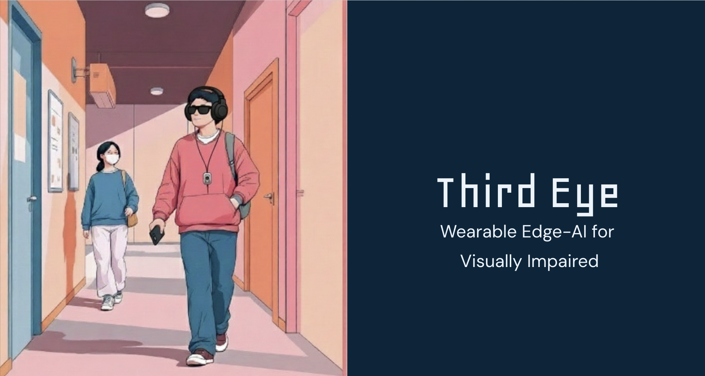
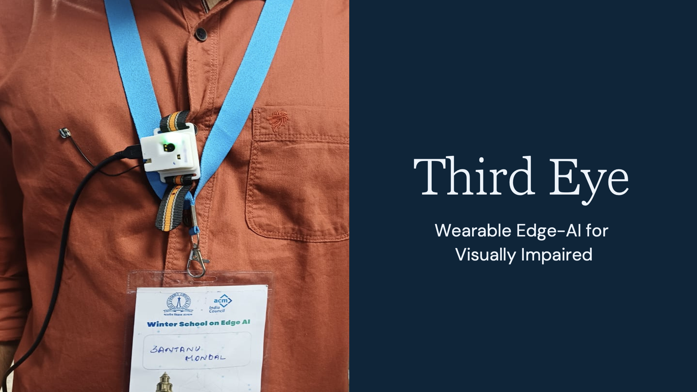

# 👁️ Third Eye – Edge AI Assistive Navigation System

A fully on-device assistive navigation system that fuses physics-based sensing with edge AI to deliver reliable, real-time guidance for visually impaired users.

---

  

## 📌 Overview

**Third Eye** is a body-worn, hands-free assistive wearable built using **Arduino Nicla Vision**, designed to help visually impaired users safely navigate indoor environments.

Unlike traditional smart sticks or helmet-mounted systems, Third Eye is compact, wearable on the body, and runs fully on-device without any cloud dependency.

The system continuously senses the environment, detects obstacles and falls, and sends real-time alerts wirelessly to a mobile or web UI.

---

## 🎥 Live Demo

<!-- 

 https://github.com/iamsantanu21/ACM-Winter-School-EdgeAI-Hackathon/blob/master/assets/demo-video/demo%20video.mp4
    
  </a>

▶️ Click the image to watch the real-time demo of the wearable assistive system in action. -->

  

▶️ Click to watch the demo

---

## ✨ Key Features

- Physics-based obstacle detection using Time-of-Flight (ToF) sensing  
- Robust fall detection using IMU-based finite state machine  
- Optional vision-based perception using edge AI  
- Fully on-device processing (no cloud, no internet)  
- Wireless real-time streaming to mobile or web UI  
- Audio alerts and visual feedback for safety events  

---

## 🧠 Design Philosophy

We combine learning-based perception with physics-based sensing to achieve robust assistive navigation.

Safety-critical decisions such as obstacle avoidance and fall detection are driven by deterministic physical measurements (distance, acceleration), while edge AI is used selectively for semantic understanding.

---

## 🧩 Hardware Used

- Arduino Nicla Vision  
  - STM32H747 Dual-Core MCU  
  - 2 MP Camera  
  - VL53L1X Time-of-Flight sensor  
  - 6-axis IMU (LSM6DSOX)  
  - Wi-Fi + BLE  

- Mobile phone / Laptop (receiver UI)

---

## 🏗️ System Architecture

Sensors (Camera + ToF + IMU)  
↓  
Multi-rate sensor fusion  
↓  
Decision logic (Safe / Obstacle / Fall)  
↓  
UDP wireless streaming  
↓  
Mobile / Web UI (audio alerts + graphs)

Every ~50 ms, sensors are sampled.  
Every ~250–1200 ms, decisions are transmitted wirelessly.

---

## 🚶 Obstacle Detection Strategy

Instead of relying only on vision, obstacle detection is primarily driven by ToF-based geometric reasoning.

- Direct distance measurement  
- Temporal smoothing using rolling median  
- Hysteresis to prevent alert flickering  
- Robust across lighting and indoor layouts  

Distance sensing provides deterministic safety guarantees, unlike purely visual inference.

---

## 🤕 Fall Detection Logic

Fall detection is implemented using a physics-based finite state machine:

1. Free fall (low acceleration)
2. Impact (high acceleration)
3. Post-impact inactivity

Once detected, a fall alert persists for several seconds to ensure reliable notification.

---

## 📱 UI & Visualization

- Real-time IMU plots  
- Obstacle and fall alerts  
- Text-to-speech audio output  
- Flashlight blinking on fall detection  
- Configurable IP and port settings  

UI implemented using Flutter (mobile) and Streamlit (web).

---

## 📊 Edge AI Optimization

| Model | Accuracy | Size (MB) |
|------|----------|-----------|
| FP32 | 0.796 | 0.179 |
| FP16 | 0.781 | 0.028 |
| INT8 | 0.802 | 0.018 |

INT8 quantization achieved the best accuracy while reducing model size by nearly 10×, making it ideal for embedded edge deployment.

---

## 🆚 Unique Selling Points

- Body-worn, hands-free design (unlike smart sticks or helmet-based systems)
- Fully on-device edge AI (no cloud, no privacy risks)
- Physics-based reasoning for safety-critical decisions
- Designed as a real-time embedded system, not just an ML demo

---

## 🚀 Getting Started

1. Flash the Nicla Vision with the final inference script using OpenMV IDE  
2. Ensure the INT8 model file is available on the device  
3. Run the receiver UI (Flutter or Streamlit)  
4. Set the correct IP address and UDP port  
5. Start walking and observe real-time alerts  

---

## ⚠️ Challenges Addressed

- Reliable obstacle detection under varying indoor lighting  
- Real-time sensor fusion on constrained edge hardware  
- Robust fall detection without false positives  
- Wireless streaming and UI latency  
- Model quantization and deployment  

---

## 🔮 Future Work

- Directional guidance (move left / right)  
- Haptic feedback integration  
- Outdoor navigation support  
- Multi-ToF sensor setup  
- Voice command interface  

---

## 🏆 Hackathon Takeaway

The main challenge was not building individual components, but making them work together reliably in real time on constrained edge hardware.

---

## 📄 License

MIT License

Get the content at: https://drive.google.com/drive/u/0/folders/1vJ3rpd_AxeCZqh6uSvXPuzTzQbBVhyR_

Get the presentation of the hackathon at: https://docs.google.com/presentation/d/13hz6AAkCS6R9HN_AuOMq6TGLBEf-kmgD/edit?usp=sharing&ouid=115210685101328742222&rtpof=true&sd=true